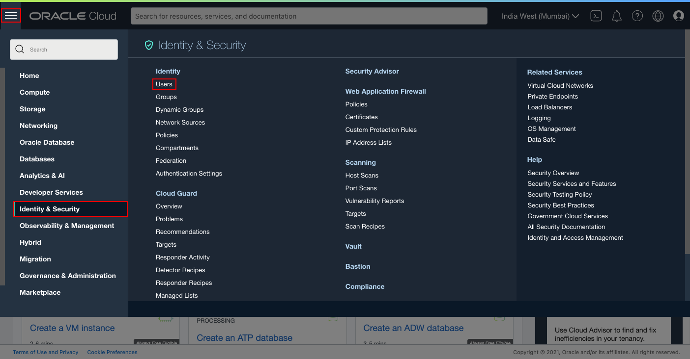

# Push the Docker Image for bobbys-helidon-stock-application to the Oracle Cloud Container Registry

## Introduction

This lab helps you to build Docker image with your Helidon application and push that image into a repository inside the Oracle Cloud Container Registry.

### Objectives

In this lab, you will:

* Build and package your application using Docker
* Generate an Authentication Token to log in to the Oracle Cloud Container Registry.
* Push Helidon application Docker image to your Oracle Cloud Container Registry repository.

### Prerequisites

* The Helidon application you have created in previous lab
* Docker
* Oracle Cloud Account


## Task 1: Build the Helidon application Docker Image

Now prepare the Docker image that you will deploy on Verrazzano.

We are creating a Docker image, which you will upload to Oracle Cloud Container Registry belongs to your OCI account. To do so you need to create image name which reflects your registry coordinates. You need the following information:

* Tenancy Namespace
* End point for the Region

You can find out your *Region Name* in top right corner in the Oracle Cloud Console, as shown in following image.


For finding the Namespace of the tenancy, select the Hamburger Menu -> Developer Services -> Container Registry, as shown. In the compartment, you will find the Namespace. Copy and save it, because we will use it in the next lab too. For example in this example the tenancy namespace is *id9hokcxpkra*.


To find out the endpoint for your Region, select this URL [https://docs.oracle.com/en-us/iaas/Content/Registry/Concepts/registryprerequisites.htm#Availab](https://docs.oracle.com/en-us/iaas/Content/Registry/Concepts/registryprerequisites.htm#Availab). In my case, it is *US EAST (Ashburn)* as the region name, thus its endpoint is *iad.ocir.io*. Find out your endpoint for your own *Region Name* and save it in the text editor. We will also need it for the next lab.


Now you have both the Tenancy Namespace and Endpoint for your region. Copy the following command and paste it in your text editor. Then replace the `END_POINT_OF_YOUR_REGION` with the endpoint of your region name and `NAMESPACE_OF_YOUR_TENANCY` with your tenancy's namespace.

```bash
<copy>docker build -t END_POINT_OF_YOUR_REGION/NAMESPACE_OF_YOUR_TENANCY/quickstart-mp:1.0 .</copy>
```
The build will produce similar result:
```bash
$ docker build iad.ocir.io/id9hokcxpkra/quickstart-mp:1.0 .
> docker pull iad.ocir.io/id9hokcxpkra/quickstart-mp:1.0
[+] Building 107.5s (19/19) FINISHED                                                                                                            
 => [internal] load build definition from Dockerfile                                                                                       0.1s
 => => transferring dockerfile: 785B                                                                                                       0.1s
 => [internal] load .dockerignore                                                                                                          0.1s
 => => transferring context: 48B                                                                                                           0.0s
 => [internal] load metadata for docker.io/library/openjdk:11-jre-slim                                                                     3.7s
 => [internal] load metadata for docker.io/library/maven:3.6-jdk-11                                                                        2.8s
 => [auth] library/openjdk:pull token for registry-1.docker.io                                                                             0.0s
 => [auth] library/maven:pull token for registry-1.docker.io                                                                               0.0s
 => [stage-1 1/4] FROM docker.io/library/openjdk:11-jre-slim@sha256:eb6b779c0a429efee5eb4bf45a3bad058ea028ac9434a24ff323b1eb73735527      33.3s
 => => resolve docker.io/library/openjdk:11-jre-slim@sha256:eb6b779c0a429efee5eb4bf45a3bad058ea028ac9434a24ff323b1eb73735527               0.0s
 => => sha256:eb6b779c0a429efee5eb4bf45a3bad058ea028ac9434a24ff323b1eb73735527 549B / 549B                                                 0.0s
 => => sha256:f3cdb8fd164057f4ef3e60674fca986f3cd7b3081d55875c7ce75b7a214fca6d 1.16kB / 1.16kB                                             0.0s
 => => sha256:9c9e40a31d4fa290f933d76f3b0a4183ba02a7298a309f6bfa892d618e7196ef 7.56kB / 7.56kB                                             0.0s
 => => sha256:99046ad9247f8a1cbd1048d9099d026191ad9cda63c08aadeb704b7000a51717 31.36MB / 31.36MB                                          18.6s
 => => sha256:e97c10298fea9915576e7ff72c6eca3d7c589aaafd6bc6481a5814c4271d2251 1.58MB / 1.58MB                                             1.6s
 => => sha256:1ad67722a7508cc8ca694c9e75efebc7c37f65d179dc2d6f36a9a1615dc5206c 211B / 211B                                                 0.7s
 => => sha256:cbeb29d69a7c2580a75906597d7cd4d59a9eff12b482810794fa01b105155358 47.13MB / 47.13MB                                          24.4s
 => => extracting sha256:99046ad9247f8a1cbd1048d9099d026191ad9cda63c08aadeb704b7000a51717                                                  7.7s
 => => extracting sha256:e97c10298fea9915576e7ff72c6eca3d7c589aaafd6bc6481a5814c4271d2251                                                  0.3s
 => => extracting sha256:1ad67722a7508cc8ca694c9e75efebc7c37f65d179dc2d6f36a9a1615dc5206c                                                  0.0s
 => => extracting sha256:cbeb29d69a7c2580a75906597d7cd4d59a9eff12b482810794fa01b105155358                                                  5.7s
 => [build 1/7] FROM docker.io/library/maven:3.6-jdk-11@sha256:1d29ccf46ef2a5e64f7de3d79a63f9bcffb4dc56be0ae3daed5ca5542b38aa2d            0.0s
 => [internal] load build context                                                                                                          0.1s
 => => transferring context: 13.99kB                                                                                                       0.1s
 => CACHED [build 2/7] WORKDIR /helidon                                                                                                    0.0s
 => [build 3/7] ADD pom.xml .                                                                                                              0.1s
 => [build 4/7] RUN mvn package -Dmaven.test.skip -Declipselink.weave.skip                                                                91.7s
 => [stage-1 2/4] WORKDIR /helidon                                                                                                         0.8s
 => [build 5/7] ADD src src                                                                                                                0.1s
 => [build 6/7] RUN mvn package -DskipTests                                                                                               10.8s
 => [build 7/7] RUN echo "done!"                                                                                                           0.5s
 => [stage-1 3/4] COPY --from=build /helidon/target/quickstart-mp.jar ./                                                                   0.1s
 => [stage-1 4/4] COPY --from=build /helidon/target/libs ./libs                                                                            0.1s
 => exporting to image                                                                                                                     0.1s
 => => exporting layers                                                                                                                    0.1s
 => => writing image sha256:587a079ad854fc79e768acda11fc05dd87d37013261249e778e80749798c2837                                               0.0s
 => => naming to iad.ocir.io/weblogick8s/quickstart-mp:1.0                                                                                 0.0s

Use 'docker scan' to run Snyk tests against images to find vulnerabilities and learn how to fix them
```
This creates the Docker image, what you can check in your local repository.

```bash
$ docker images

REPOSITORY                                                                           TAG                               IMAGE ID       CREATED         SIZE
iad.ocir.io/id9hokcxpkra/quickstart-mp                                                1.0                               587a079ad854   5 minutes ago   243MB
```
Please note the replaced full image name `END_POINT_OF_YOUR_REGION`/`NAMESPACE_OF_YOUR_TENANCY`/quickstart-mp:1.0 because you will need it later.

## Task 2: Generate an Authentication Token to Login to the Oracle Cloud Container Registry

In this step, we are going to generate an *Authentication Token*, that we will use to log in to the Oracle Cloud Container Registry.

Select the User Icon in the top right corner and then select *User Settings*.



Scroll down and select *Auth Tokens*.


Click *Generate Token*.


Copy *quickstart-mp* and paste it in the *Description* box and click *Generate Token*.


Select *Copy* under Generated Token and paste it in the text editor. We cannot copy it later.


## Task 2: Push the Helidon application (quickstart-mp) Docker image to your Oracle Cloud Container Registry Repository

In this lab you already opened a URL [https://docs.oracle.com/en-us/iaas/Content/Registry/Concepts/registryprerequisites.htm#Availab](https://docs.oracle.com/en-us/iaas/Content/Registry/Concepts/registryprerequisites.htm#Availab) and determined the endpoint for your Region name in a text editor. In my case, it is US East (Ashburn).


Copy the following command and paste it in your text editor and then replace the `END_POINT_OF_REGION_NAME` with the endpoint of your region.
```bash
<copy>docker login END_POINT_OF_REGION_NAME</copy>
```

In the previous step, you also determined the Tenancy Namespace. Make the user name as follows: `NAMESPACE_OF_YOUR_TENANCY`/oracleidentitycloudservice/`YOUR_ORACLE_CLOUD_USERNAME`. Here, replace `NAMESPACE_OF_YOUR_TENANCY` with your tenancy's namespace and `YOUR_ORACLE_CLOUD_USERNAME` with your Oracle Cloud Account user name and then copy the replaced user name from your text editor and paste it in the *Cloud Shell*. For Password , paste the Authentication Token from your text editor or where you saved it.
```bash
$ docker login iad.ocir.io
Username: id9hokcxpkra/oracleidentitycloudservice/YOUR_ORACLE_CLOUD_USERNAME
Password:
Login Succeeded
```

Go back to the Container Registry, select *Hamburger Menu -> Developer Services -> Container Registry*.


Select the compartment and then click *Create Repository*.


Select the compartment and enter *helidon-stock-application* as the Repository Name, then choose Access as *Public* and then click *Create Repository*.


After the repository *quickstart-mp* has been created you can verify in the repository list and its settings.


To push your Docker image into your repository inside the Oracle Cloud Container Registry, copy and paste the following command in your text editor and then replace `ENDPOINT_OF_YOUR_REGION_NAME`/`NAMESPACE_OF_YOUR_TENANCY`/quickstar-mp:1.0 with Docker image full name, which you have saved earlier.

```bash
<copy>docker push `ENDPOINT_OF_YOUR_REGION_NAME`/`NAMESPACE_OF_YOUR_TENANCY`/quickstart-mp:1.0</copy>
```
You get similar result:
```bash
$ docker push iad.ocir.io/id9hokcxpkra/quickstart-mp:1.0
The push refers to repository [iad.ocir.io/id9hokcxpkra/quickstart-mp]
0795b8384c47: Pushed
131452972f9d: Pushed
93c53f2e9519: Pushed
3b78b65a4be9: Pushed
e1434e7d0308: Pushed
17679d5f39bd: Pushed
300b011056d9: Pushed
1.0: digest: sha256:355fa56eab185535a58c5038186381b6d02fd8e0bcb534872107fc249f98256a size: 1786
```

After the *docker push* command ran successfully, expand the *quickstart-mp* repository and you will notice a new image has been uploaded in this repository.


Leave the *Cloud Shell* and Container Registry repository page open; we will need them for the next labs.

## Acknowledgements

* **Author** -  Peter Nagy
* **Contributors** - Maciej Gruszka, Peter Nagy
* **Last Updated By/Date** - Peter Nagy, August 2021
